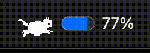

# Codex Gauge

# 토큰 남은 사용량 보여주어요

[](https://git.io/typing-svg)



# 맥 전용이고 M1 이상만 되어요

[](https://git.io/typing-svg)


# 인증되지 않은 앱 이어요


# 설치는 이렇게 하셔요

1. [Releases](https://github.com/RabbitTasteDog-PRO/codex_gauge/releases)에서 앱 ZIP을 받아요.
2. 압축 풀고 `Codex Gauge.app`을 응용 프로그램 폴더에 넣어요.
3. Codex CLI가 없으면 터미널에서 이거 한 번 실행해요. [공식 설치 안내](https://learn.chatgpt.com/docs/codex/cli)

    ```sh
    curl -fsSL https://chatgpt.com/codex/install.sh | sh
    ```

4. 앱 더블 클릭하고 브라우저에서 내 ChatGPT 계정으로 로그인해요. 
5. 위에 고양이 뜨면 된 거예요.

실행이 막히면 출처를 확인하고 **시스템 설정 → 개인정보 보호 및 보안 → 그래도 열기**로 열어요.

[](https://git.io/typing-svg)


# 문제가 생겼기면 
[](https://git.io/typing-svg)

# 안받으면 되어요

# 마음껏 수정하세요 

## 릴리즈 파일과 업로드

앱 ZIP과 체크섬 파일 생성:

```sh
bash scripts/package-release.sh
```

--- 
생성 결과는 `dist/releases/v버전/`에 저장됩니다. [GitHub 릴리즈 업로드 안내](docs/RELEASING.md)에 첫 커밋·푸시부터 태그 생성, 파일 첨부와 게시 순서를 정리했습니다.


공식 인터페이스: [Codex App Server](https://learn.chatgpt.com/docs/app-server), [Apple NSStatusItem](https://developer.apple.com/documentation/appkit/nsstatusitem).
